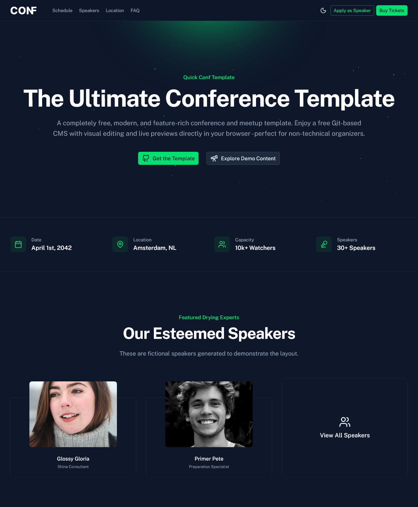
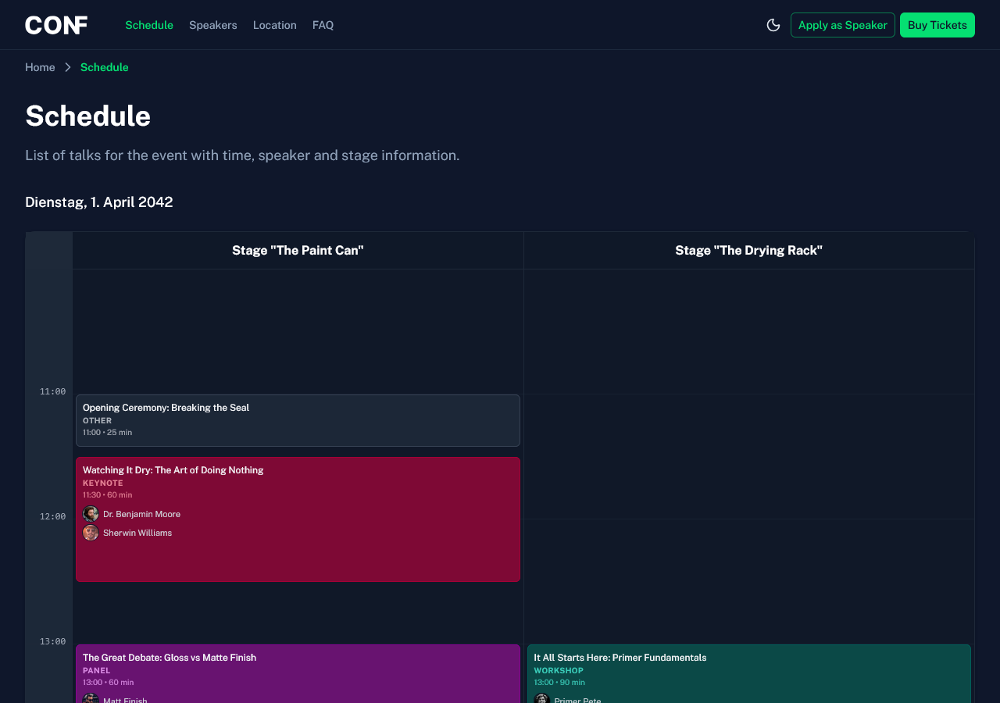
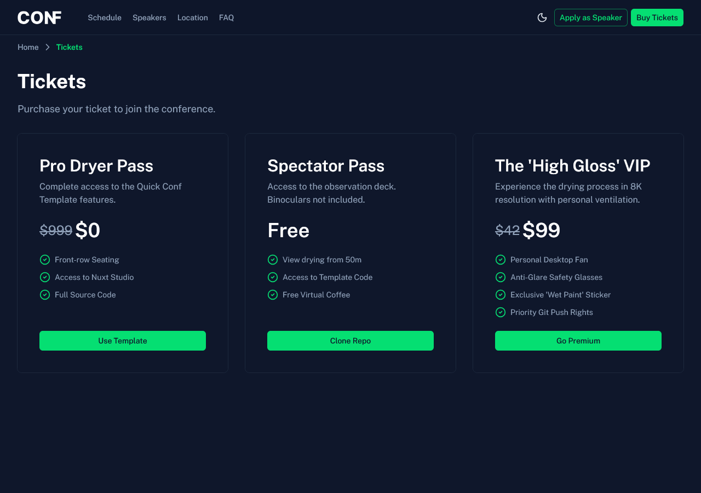
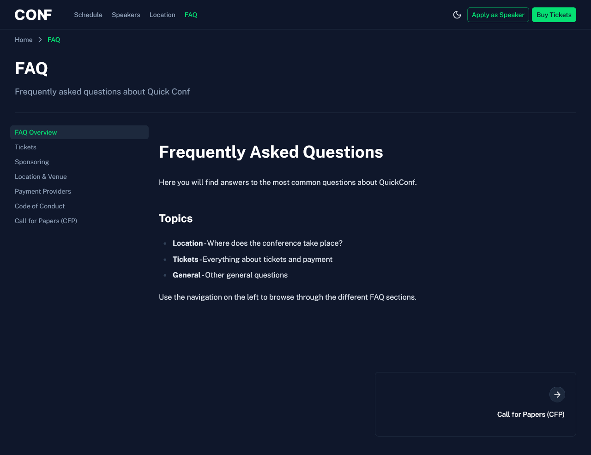

# quick-conf

This is a **completely free** template for quickly setting up a new Conference or Meetup website, powered by **Nuxt Studio** under the hood as a Git-based CMS. Everything included - the template itself, all dependencies, and the CMS - is available at no cost. It features **visual editors**, **live previews** directly in your browser, and an intuitive interface, making it effortless to manage content without touching code. Once set up, it is the perfect solution for non-technical users, as all content updates can be handled visually through the browser interface.

> [!NOTE]
> While the template and tools are free, hosting and deployment costs are not included and depend on your chosen provider.

## 🚀 Key Features

- **🎨 Customizable**: Fully theming via Nuxt UI and configuration files - your colors, your style!
- **📝 CMS Integration**: Nuxt Studio ready for visual editing - directly in the browser!
- **⚡ Modern Stack**: Nuxt 4, Vue 3, Tailwind CSS v4, TypeScript.
- **🔍 SEO Ready**: Pre-configured with:
  - ✅ Automatic **Sitemap** (`/sitemap.xml`)
  - ✅ Dynamic **OG Images** (Social Cards) for speakers, talks & pages
  - ✅ Smart **Robots.txt** (Blocks AI Bots, permits legitimate crawlers)
  - ✅ JSON-LD Structured Data

## 🌐 Live Demo

You can find a deployed version of this template to test and view here:

> 🔗 [https://quick-conf.com/](https://quick-conf.com/)

📸 Screenshots

_The main landing page showcasing the flexible block system:_

_The interactive conference schedule with stages and talks:_

_A clear overview of available ticket categories and pricing:_

_The FAQ section for attendee questions:_

## Sponsoring

If you like this project and want to support me, I would be thrilled to see you as a sponsor on GitHub ❤️ 
You can find the `Sponsor` button on the top right of the [GitHub project page](https://github.com/toddeTV/quick-conf). 
Thank you for the support <3

It also helps me a lot if you follow me on social media and stay up to date with my latest projects! ❤️

- [GitHub](https://github.com/toddeTV/)
- [X (Twitter)](https://x.com/toddeTV)
- [Bluesky](https://bsky.app/profile/todde.tv)
- [LinkedIn](https://www.linkedin.com/in/toddetv/)

## Documentation

All documentation is in the [docs](/docs) folder.

## Want to use the template for setting up a conference website?

We provide a CLI tool to help you get started quickly. Please refer to the [Template Usage Documentation](/docs/template-usage.md) for getting started with detailed installation and update instructions.

I would be thrilled to see how you are using this template! If you have launched a website for your conference or meetup with it, please consider adding it to the [showcase](/docs/usage.md) in this repository.

## Want to contribute to the template itself?

Check out our [Contribution Guidelines](CONTRIBUTING.md) to get started.

## Contribution & Attribution

### Project Contributors

### Current Core Team Members

- [Thorsten Seyschab](https://todde.tv) as Project Founder & Lead.
  - [GitHub](https://github.com/toddeTV/)
  - [X (Twitter)](https://x.com/toddeTV)
  - [Bluesky](https://bsky.app/profile/todde.tv)
  - [LinkedIn](https://www.linkedin.com/in/toddetv/)

### Acknowledgments

**Special Thanks:** 
_(People who provided valuable help on specific topics or issues)_

- [Alexander Lichter](https://github.com/TheAlexLichter) as a guest on one of the Twitch live streams,
  contributing to the brainstorming & creation of the main project structure.
- [Andreas Fehn](https://github.com/fehnomenal) as a guest on one of the Twitch live streams, contributing
  to the creation of the data model for the content collections and schemas.

**Helpful Projects:** 
_(Projects that provided valuable inspiration or resources.)_

- [Nuxt SaaS Template](https://github.com/nuxt-ui-templates/saas) served as a helpful source of inspiration at the start of the project and was occasionally referenced for some code, best practices and structural ideas.

**Additional Tools:** 
_(excluding those listed in `./package.json`)_

- [Twitch @toddeTV](https://twitch.tv/toddeTV) was used for live streaming the development of this project.
- [CodeRabbit](https://www.coderabbit.ai/) was used as an AI code review assistant to help improve code quality and maintain best practices.
- [Pravatar](https://pravatar.cc/) was used to provide placeholder avatars for development, licensed under [CC0](https://creativecommons.org/publicdomain/zero/1.0/) (Public Domain).
- [Unsplash](https://unsplash.com/) was used to provide example images for development, licensed under the [Unsplash License](https://unsplash.com/license) (free for commercial and non-commercial purposes with no attribution needed).
- [Picsum Photos](https://picsum.photos/) was used for placeholder images during development.
- [placehold.co](https://placehold.co/) was used for placeholder images and logos that contain custom text during development.

**Assets & Materials Used:** 
_(including images & 3D models; mostly only those requiring attribution)_

- \[currently none\]

## License

**Copyright (c) 2025-present, [Thorsten Seyschab](https://todde.tv)**

This project is a template and is licensed under a dual-license structure. The source code is available under the MIT License, while the content and assets are under a more restrictive license.

- **Source Code:** The source code in this repository is licensed under the **MIT License**. You are free to use, copy, modify, merge, publish, distribute, sublicense, and/or sell copies of the software.

- **Content & Assets:** The contents of the `/content` and `/public` directories (such as images, 3D models, videos, and data files) are **not** licensed under MIT. These materials are the intellectual property of their respective creators and are provided solely as placeholders for local development. Remove or replace them before distributing your site. Unless a file carries its own license, no rights are granted to reuse these materials. You may not reuse, redistribute, or create derivative works from these materials without explicit permission from the original authors.

Please refer to the [LICENSE.md](/LICENSE.md) file for full details.

### Third-Party Libraries

This project utilizes third-party libraries and other materials. These components are the property of their respective owners and are licensed under their own terms. A list of these can be found in the [_Contribution & Attribution_](#contribution--attribution) section in this document above, in the [package.json](/package.json) and in the project's documentation.

### Need a Different License?

If the standard licensing does not fit your needs, feel free to reach out to discuss custom arrangements.
