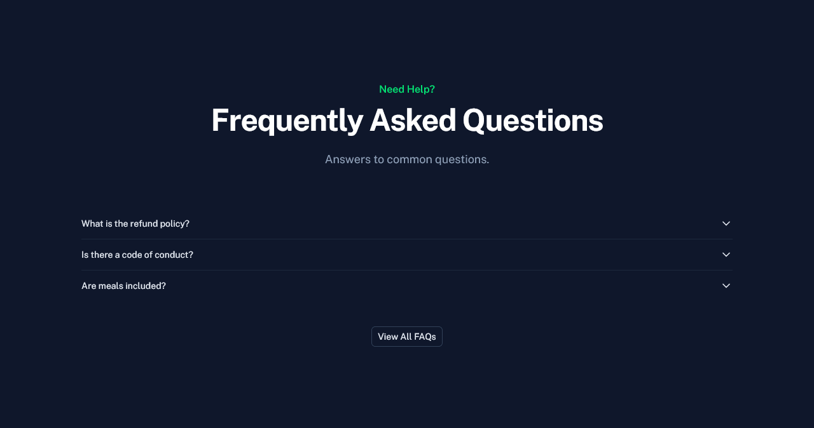
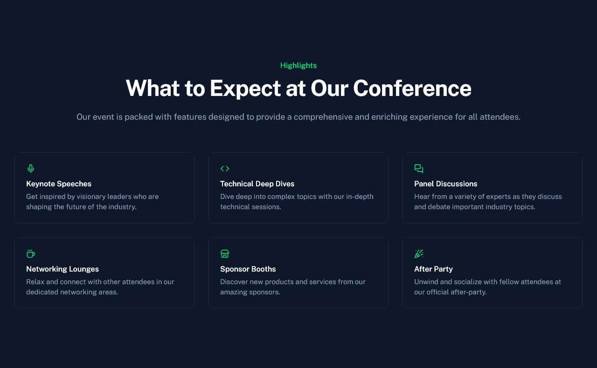
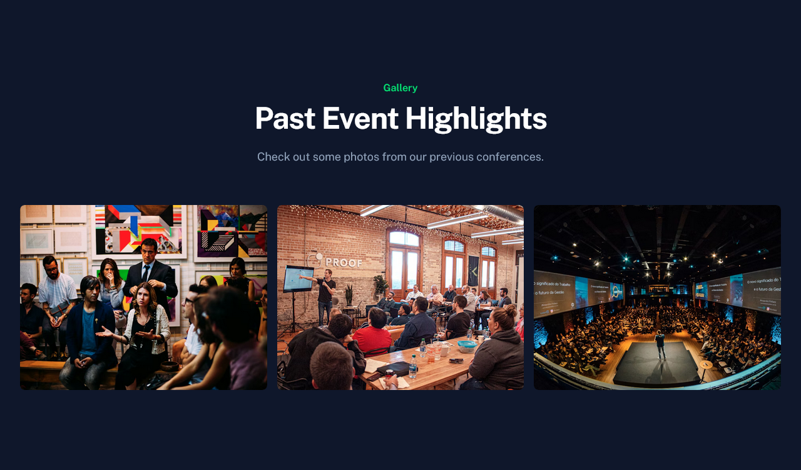
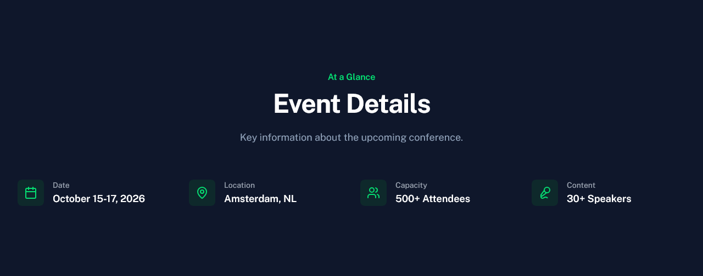
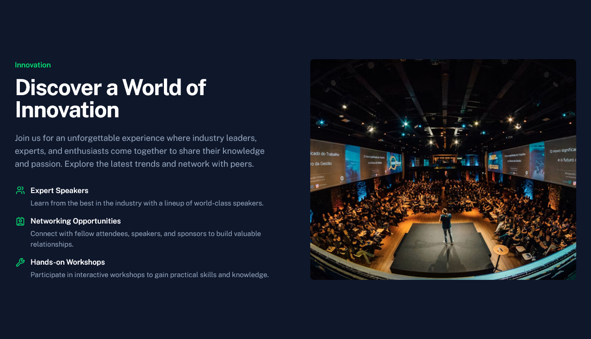
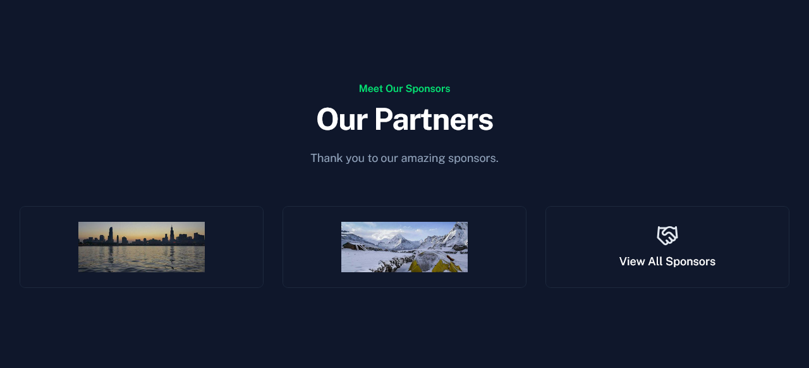

# Landing Page Blocks

The landing page of Quick Conf is composed of modular blocks defined in `content/1.index.yml`. Each block corresponds to a Vue component in `app/components/app/landing/`.

## Available Blocks

Click on a block to see its full documentation, including code examples and property details.

- [**AppLandingCta**](./AppLandingCta.md) 
  

- [**AppLandingFaqPreview**](./AppLandingFaqPreview.md) 
  

- [**AppLandingFeatures**](./AppLandingFeatures.md) 
  

- [**AppLandingGallery**](./AppLandingGallery.md) 
  

- [**AppLandingHero**](./AppLandingHero.md) 
  

- [**AppLandingHeroCountdown**](./AppLandingHeroCountdown.md) 
  

- [**AppLandingHeroMedia**](./AppLandingHeroMedia.md) 
  

- [**AppLandingMarquee**](./AppLandingMarquee.md) 
  

- [**AppLandingMetaInfo**](./AppLandingMetaInfo.md) 
  

- [**AppLandingSection**](./AppLandingSection.md) 
  

- [**AppLandingSeparator**](./AppLandingSeparator.md) 
  

- [**AppLandingSpeakers**](./AppLandingSpeakers.md) 
  

- [**AppLandingSponsors**](./AppLandingSponsors.md) 
  

- [**AppLandingTestimonials**](./AppLandingTestimonials.md) 
  

## Property Presets

Common property sets used across multiple blocks:

- [ButtonProps](./property-presets/ButtonProps.md) - Configuration for buttons and links.
- [ImageProps](./property-presets/ImageProps.md) - Standard image object structure.
